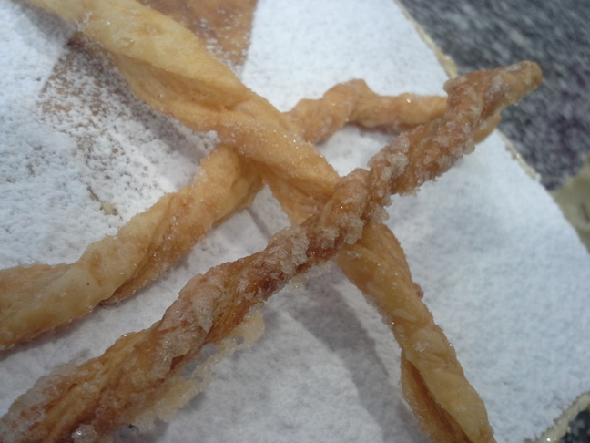
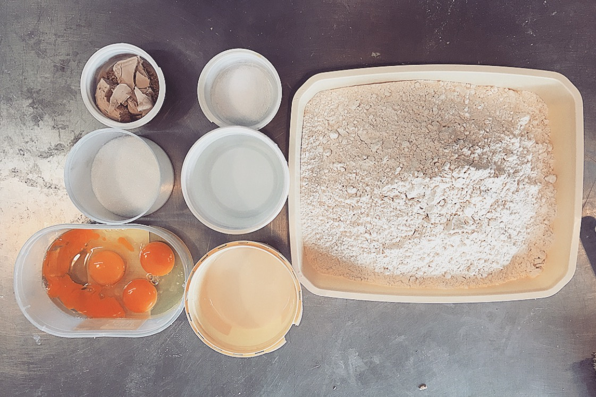
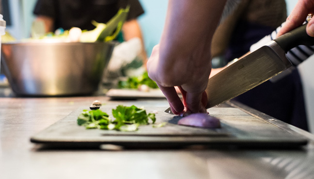
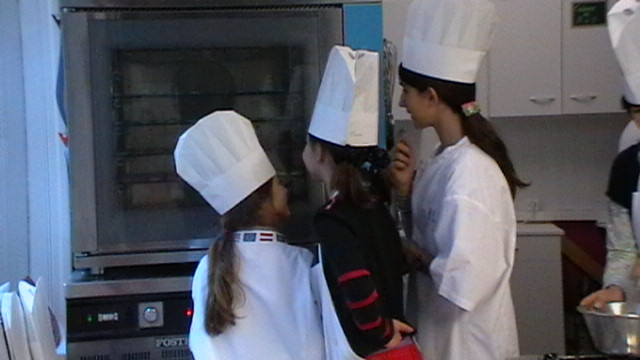

	title: Cours de cuisine et de pâtisserie
	related: cours/informations
	---
## Cours de pâtisserie

Arnaud Houley, maître pâtissier, vous aidera à parfaire vos connaissances en pâtisserie, chocolaterie et confiserie.
Les cours se déroulent à [l'Atelier de pâtisserie](informations#l-atelier-de-patisserie).

Pour planifier votre cours, n'hésitez pas à contacter Arnaud par téléphone au 06 64 50 71 23 ou par courriel <contact@flvm.fr>

[Choisir un cours de pâtisserie](/planning){.btn .btn-cta}

## Cours de boulangerie 

Rémy Guilbeau vous montrera le chemin de la panification et autres tours de mains propres aux boulangers, il vous acueillera dans le fournil du 160 rue Eau de Robec.

Afin de planifier un cours, contactez le au 06 88 89 44 33.

[Le 160 c'est par ici](informations#le-160).

[Choisir un cours de boulangerie](/planning){.btn .btn-cta}
## Cours de cuisine

Stéphanie Egret vous accompagnera dans l'élaboration de recettes, elle vous donnera les trucs et astuces qui font la différence.  

Stéphanie vous accueillera au 160 rue Eau de Robec, inscription au 06 41 73 81 93 

[Le 160 c'est par ici ](informations#le-160).

### Les petites Toques

Stéphanie propose également des cours pour enfants. Des recettes spécialement élaborées pour les enfants, faciles à refaire à la maison.

Pour inscrire vos enfants, n'hésitez-pas à contacter Stéphanie au 06 41 73 81 93 ou à <contact@flvm.fr>

[Choisir un cours de cuisine](/planning){.btn .btn-cta}

