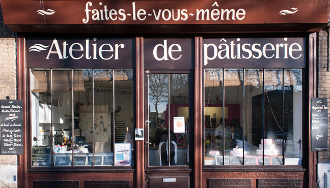

	Title: À propos de FLVM
	Description: FLVM, ateliers Rouennais de cours de cuisines et de pâtisseries
	Related: contact, team/marie-lionis, team/arnaud-houley, team/stephanie-egret, team/raphael-lemmonier
	---

# Faites le vous même {#introduction}

FLVM vous propose des cours de cuisine et de pâtisserie pour adulte et enfants.

Nos cours ce déroulent dans [nos ateliers à Rouen](informations#ateliers), nous mettons un point d'honneur à pratiquer des [tarifs accèssibles à tous](informations#tarifs).

## Horaires {#horaires}

Nous proposons 3 horaires par jours du lundi au samedi, chaque cours dure 3 heures.

 - de 9h30 à 12h 30
 - de 14h30 à 17h30
 - et de 18h30 à 21h30

## Les ateliers {#ateliers}

### Le 160 {#le-160}

Les fourneaux du 160 sont équipé pour les cours de cuisine et les cours de boulangerie.

Le 160
 : <address>
	160, rue eaux de Robec, Passage de la petite horloge.
	 
	76 000 Rouen
</address>

: Pour les réservations contactez *Arnaud Houley* au 06 41 73 81 93 et à <contact@flvm.fr>

[Trouver sur une carte](https://www.google.fr/maps/place/160+Rue+Eau+de+Robec,+76000+Rouen/@49.4415101,1.0988835,17z/data=!3m1!4b1!4m2!3m1!1s0x47e0ddd562561ac5:0x10270a15c9d5e977){.btn}

### L'Atelier de pâtisserie {#l-atelier-de-patisserie}

L'atelier de pâtisserie accueil les cours de pâtisserie pour adulte et enfant.

L'atelier de pâtisserie
 : <address>
	2pl du 39 ème régiment d'infanterie 
	 
	76 000 Rouen
	</address>
 : Pour les reservations contactez *Stéphanie Egret* au 06 41 73 81 93 et à <contact@flvm.fr>

[Trouver sur une carte](https://www.google.fr/maps/place/Faites-Le+Vous-M%C3%AAme+-+Atelier+de+p%C3%A2tisserie/@49.4406801,1.1008133,17z/data=!4m7!1m4!3m3!1s0x47e0dc2bb55e0a75:0x86a03c89a2500d8b!2sFaites-Le+Vous-M%C3%AAme+-+Atelier+de+p%C3%A2tisserie!3b1!3m1!1s0x47e0dc2bb55e0a75:0x86a03c89a2500d8b){.btn}

## Tarifs {#tarifs}

Tarif de groupe
: **35€ par personne** pour un groupe de 5 personnes minimun.

Tarif réduit
: **25€ par personne** pour les étudiants, les demandeurs d'emploi et les enfants de moins de 12 ans.

Tarif individuel et cours à la demande
: Si vous souhaitez un cours individuel ou un cours pour une occasion spéciale, n'hésitez-pas à [nous contacter](lien-vers-contact).

Adhésion
: L'adhésion à l'association est obligatoire pour profiter des cours, elle est à prix libre (minimu 1€).
