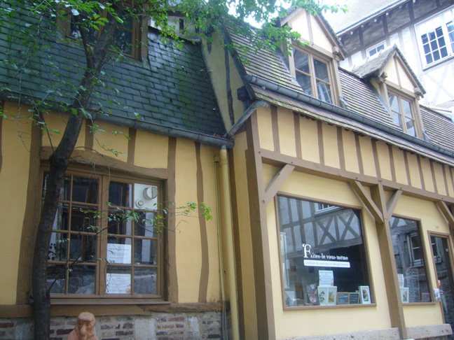
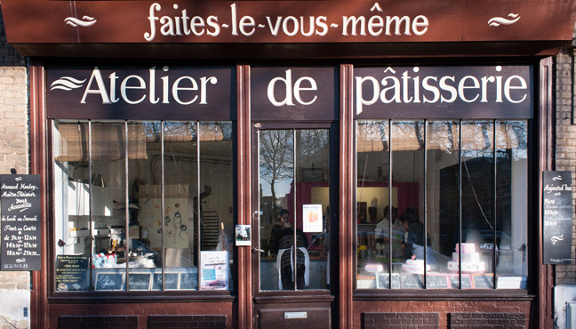

	Title: À propos de FLVM
	Description: FLVM, ateliers Rouennais de cours de cuisines et de pâtisseries
	Related: informations/contact, informations/team/arnaud-houley, informations/team/drilona-richard, informations/team/marie-lionis
	---

# Faites-Le Vous-Même {#introduction}

FLVM vous propose des cours de cuisine et de pâtisserie pour adultes et enfants.

Nos cours se déroulent dans [nos ateliers à Rouen](informations#ateliers), nous mettons un point d'honneur à pratiquer des [tarifs accessibles à tous](informations#tarifs).

## Tarifs {#tarifs}
Tarif cours pour deux personnes:
: **67€ / personne**

Tarif trois à quatre personnes:
: **47€ / personne**

Tarif de groupe
: **37€ par personne** pour un groupe de 5 personnes minimun.

Tarif réduit
: **27€ par personne** (groupe de 4 personnes minimum) pour les étudiants, les demandeurs d'emploi et les enfants.

Cours à la demande
: Si vous souhaitez un cours pour une occasion spéciale, n'hésitez-pas à nous contacter.

Adhésion
: L'adhésion à l'association est obligatoire pour profiter des cours, elle est comprise dans le prix du cours.

Carte Cadeaux
: Offrez un cours à un **enfant pour 30€** ou à un **adulte pour 50€***.  
<small>* donne droit à un cours collectif, carte valable ilimité de temps.</small> 

## Pour réserver vos cours
Pour **réserver un cours de pâtisseries**, contacter notre pâtissier Arnaud au 06 64 50 71 23.

Les **cours de cuisines sont à réservez** auprès de notre cuisinière Drilona, écrivez-lui à <drilona@flvm.fr>.

Vous voulez **organiser un événement original** autour de la cuisine et de la pâtisserie, nous pouvons vous proposer des prestations sur mesure; n'hésitez-pas à nous en faire part à <contact@flvm.fr>, nous vous contacterosn rapidement pour vous accompagner.

## Horaires {#horaires}

Nous proposons 3 horaires par jours du lundi au samedi, chaque cours dure 3 heures.

 - de 9h30 à 12h 30
 - de 14h30 à 17h30
 - et de 18h30 à 21h30

## Les ateliers {#ateliers}

### Le 160 {#le-160}
Le 160 rue Eau de Robec est équipé pour les cours de boulangerie, de cuisine.

Le 160
:   160, rue eaux de Robec, Passage de la petite horloge.
	 
	76 000 Rouen
	[Afficher sur une carte](https://www.google.fr/maps/place/160+Rue+Eau+de+Robec,+76000+Rouen/@49.4415101,1.0988835,17z/data=!3m1!4b1!4m2!3m1!1s0x47e0ddd562561ac5:0x10270a15c9d5e977){.btn}

 Pour les réservations cuisine, contactez *Marie Lionis* au 06 62 81 56 74

 Ecrivez à <contact@flvm.fr> en laissant vos coordonnées téléphoniques.

### L'Atelier de pâtisserie {#l-atelier-de-patisserie}

L'atelier de pâtisserie accueille les cours de pâtisserie pour adultes et enfants.

L'atelier de pâtisserie
:	2pl du 39 ème régiment d'infanterie
	 
	76 000 Rouen
	[Afficher sur une carte](https://www.google.fr/maps/place/Faites-Le+Vous-M%C3%AAme+-+Atelier+de+p%C3%A2tisserie/@49.4406801,1.1008133,17z/data=!4m7!1m4!3m3!1s0x47e0dc2bb55e0a75:0x86a03c89a2500d8b!2sFaites-Le+Vous-M%C3%AAme+-+Atelier+de+p%C3%A2tisserie!3b1!3m1!1s0x47e0dc2bb55e0a75:0x86a03c89a2500d8b){.btn}

 Pour les réservations pâtisserie, contactez *Arnaud Houley* au 06 64 50 71 23

 Ecrivez à <contact@flvm.fr> en laissant vos coordonnées téléphoniques.
