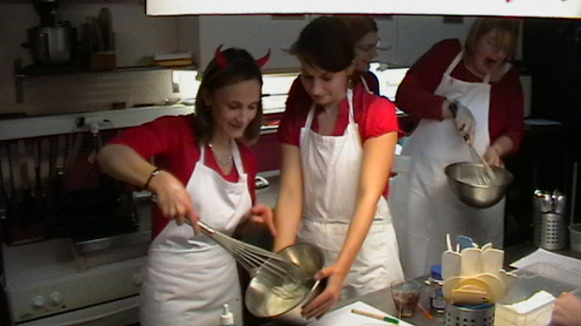
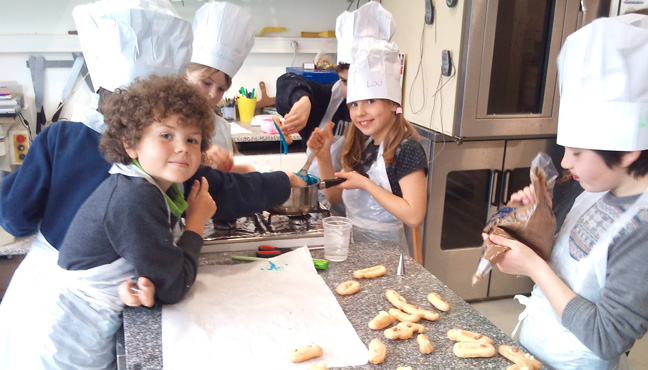

	Title : FLVM
    related : welcome/les-ateliers
	---
## Offrez un cadeau savoureux
Pour les enfants ou les adultes, Faites découvrir les trucs et astuces de pâtisserie et de cuisines en offrant une carte-cadeaux FLVM.

[Offrir une carte-cadeaux](informations#tarifs-carte-cadeaux){.btn-cta}

## Team Building
FLVM, c’est aussi un lieu pour vos événements professionnels, n’hésitez pas à nous contacter à <contact@flvm.fr>. 

## Enterrement de vie de jeune fille

Faites une surprise à la future mariée et offrez-lui un cours mémorable de cuisine et de pâtisserie !

## Laisse ton cartable et mets ton tablier&nbsp;!

Viens me retrouver après la classe, à partir de 17h du lundi au vendredi. Nous apprendrons ensemble trucs et astuces de pâtissier et cuisinier ! 
Si tu veux, dès les mercredis matins, tu peux aussi réaliser du bon pain ou de la viennoiserie! MIAM 😋

[Réserver un cours](planning){.btn-cta}

### Un anniversaire original
invite tes copains pour réaliser la pâtisserie ou la cuisine de ton choix.

### Retrouvez-nous
Mettez les photos de vos cours et [vos commentaires sur Facebook](https://www.facebook.com/flvm.cours/)
