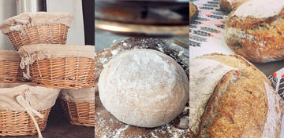

	title: L'atelier du 160
	---
# Au 160 rue Eau de Robec

## Atelier Pain
Venez réaliser du Pain Bio au levain ...

## La cuisine du 160
Composez votre menu : entrée/plat ou plat/dessert
Apéritif dinatoire, bouchées diverses et variées, terrine de poisson et poisson en papillote ;
Poulet au cidre, cassoulet, boeuf bourguignon et autre porc en croûte n'auront plus de secret pour vous !

# Au 2 place du 39è Régiment d'Infanterie

## Atelier Viennoiserie
Confectionnez les croissants et pains chocolat de votre enfance et autres gourmandises d'exception !

## Atelier pâtisserie
Venez apprendre à réaliser tous les gateaux professionnels que vous aurez envie de refaire à la maison
