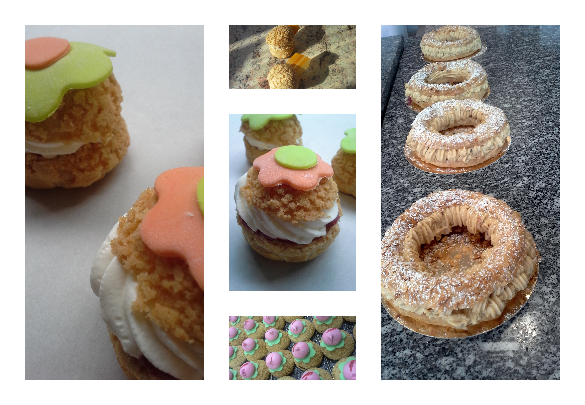

	title: Cours de pâte à choux
	---
#Avril : le mois de la pâte à choux

##Les choux Craqueline
Vous réaliserez des merveilleux choux à base de pâte à craquelin, garnis de différents parfums. 

##Le Paris-Brest
Le fameux dessert en forme de roue, inventée en 1891 en hommage à la course cycliste à base de praliné maison.

##Les éclairs
Vous fabriquerez les éclairs de Paris avec différents parfums et glaçages

##Le saint-honoré
Le fond de pâte brisée est garni de pâte à choux avant la cuisson. Il est ensuite recouvert de crème pâtissière et son pourtour de petits choux garnis toujours avec cette même crème puis nappés de caramel à leur sommet. Le gâteau se termine en emplissant son centre d'une simple crème chantilly. Cette crème est disposée avec une douille à Saint-honoré.

##les chouquettes
La chouquette, parsemée de sucre perlé, est faite de pâte à choux , cuite dans un four.