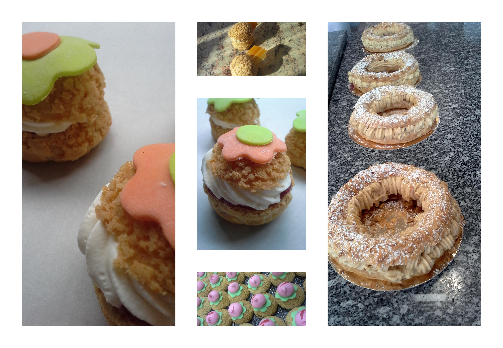

#cours de pâte à choux

##les choux craqueline

vous réaliserez des merveuilleux choux à base de pâte à craquelin, garnis de differents parfums. 

##le Paris-Brest:
le fameux dessert à base de praliner maison

##les éclairs
vous fabriquerez les éclairs de Paris avec différents parfums et glaçages

##le saint-honoré
Le fond de pâte brisée est garni de pâte à choux avant la cuisson. Il est ensuite recouvert de crème pâtissière et son pourtour de petits choux garnis toujours avec cette même crème puis nappés de caramel à leur sommet. Le gâteau se termine en emplissant son centre d'une simple crème chantilly. Cette crème est disposée avec une douille à Saint-honoré.

##les chouquettes
La chouquette, parsemée de sucre perlé, est faite de pâte à choux , cuite dans un four.